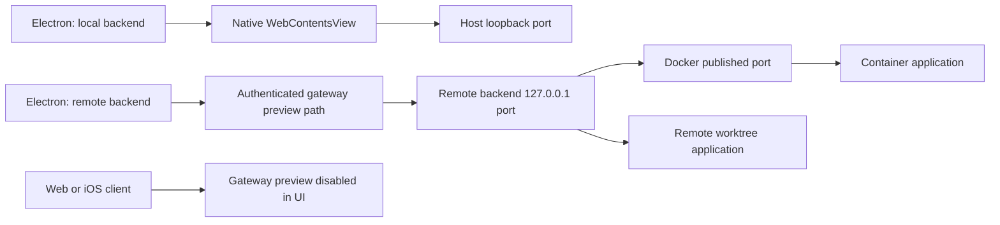

# Current behavior and findings

Snapshot: 2026-09-20–21 at `88c2f9cc`. This is an investigation, not a description
of proposed functionality as already shipped.

## How a page reaches the client

For a container application listening on port `3000`, Docker might publish
`127.0.0.1:49152 -> container:3000`. The environment's browser button opens
`http://localhost:49152/`. When Electron is connected remotely, that becomes
`https://<backend>/__orkestrator/browser/loopback/49152/`. The gateway forwards
to **its own** `127.0.0.1:49152`; the browser never connects to the container
directly. A worktree server can be addressed through the same gateway using
the port it actually listens on at the backend.

| Client/target | Current behavior |
| --- | --- |
| Electron, local worktree | Direct HTTP loopback navigation in a native view; user supplies the port. |
| Electron, local container | Direct navigation to the published host port. Entry-port button resolves it. |
| Electron, remote worktree/container | Native view loads gateway preview path; Electron injects gateway authorization. |
| Gateway-served web client, including a loopback gateway | Preview availability check rejects it unless `gateway.desktop === true`. |
| Hosted web client or iOS | Preview unavailable; UI directs the user to desktop. |
| Renderer without gateway/native integration | Iframe fallback can load direct HTTP loopback pages. This is not remote-web support. |
| Arbitrary remote hostname or HTTPS development server | Address validation rejects it. Remote access means selecting an Orkestrator backend, then using that backend's loopback. |

Sources:
[address validation](../../../apps/web/src/lib/browser-address.ts),
[gateway URL routing](../../../apps/web/src/lib/gateway-url.ts),
[entry-port addresses](../../../apps/web/src/lib/environment-address.ts),
[BrowserTab](../../../apps/web/src/components/browser/BrowserTab.tsx), and
[gateway handlers](../../../apps/backend/src/gateway-handlers.ts).

## Existing foundations worth preserving

- Docker publishes configured ports and the automatic entry port on host
  `127.0.0.1`, rather than intentionally exposing development servers on every
  host interface. Startup resolves and stores `hostEntryPort`.
- Native previews have Node integration disabled, context isolation and
  Chromium sandboxing enabled, no application preload, constrained navigation,
  denied popups, and permission restrictions. DevTools and annotations exist.
- Production Electron partitions previews by **window slot and connection**.
  They are separate from renderer sessions; changing the connection replaces
  the preview manager. The default partition in the startup helper is not the
  production partitioning policy.
- Native views live in the main process. React cleanup hides them; tab closure
  destroys them. Reattach returns a snapshot. An inactive environment is not
  meant to terminate its work.
- Gateway previews require authentication. Electron limits credential injection
  for preview subresources to their preview namespace. The proxy removes the
  gateway authorization and gateway cookie before forwarding upstream.
- The rewrite path already bounds source/decoded/rewritten bodies to 8 MiB,
  buffered chunks to 8,192, and shared decoded bytes to 64 MiB. Disconnects
  cancel upstream requests. These controls should survive any replacement.

Sources:
[container creation](../../../apps/backend/src/core/commands-containers.ts),
[environment startup](../../../apps/backend/src/core/commands-environment.ts),
[native manager](../../../apps/desktop/electron/browser-preview-manager.ts),
[production partitioning](../../../apps/desktop/electron/desktop-window-lifecycle.ts),
[main-process wiring](../../../apps/desktop/electron/main.ts),
[credential injection](../../../apps/desktop/electron/remote-gateway-request-auth.ts),
[proxy](../../../apps/backend/src/gateway-proxy.ts), and
[transport limits](../../../apps/backend/src/gateway-support-core.ts).

## F1. Browser addressing loses container and service identity

**Confirmed in code.** `BrowserTabData` persists a URL, not a service reference.
`getEnvironmentBrowserUrl()` converts only the configured entry port to its
published host port. The terminal-link listener passes `request.url` straight
to `createBrowserTab()`; it does not resolve container ports.

Consequences inferred from that flow:

- A container prints `http://localhost:3000`, but its actual published port is
  `49152`. Opening the terminal link targets backend port `3000`, which might
  be absent or belong to another environment.
- After container recreation, a saved tab can retain the old host port. Even
  though environment startup refreshes `hostEntryPort`, the tab is not tied to
  that mapping. Port reuse can make the error look like a successful load of
  the wrong application.
- An application embedding `http://localhost:3000/api` in its responses still
  refers to a container port. The proxy's absolute-URL rewriter matches the
  upstream **host** port, so it misses that URL when the ports differ.

Sources:
[tab schema](../../../apps/web/src/types/paneLayout.ts),
[terminal link handling](../../../apps/web/src/components/terminal/TerminalContainer.view.tsx),
[entry URL resolver](../../../apps/web/src/lib/environment-address.ts), and
`rewriteBrowserPreviewBody()` in
[gateway helpers](../../../apps/backend/src/gateway-support-extra.ts).

## F2. Remote previews have no WebSocket forwarding

**Confirmed in code.** The gateway's `upgrade` listener delegates exclusively
to `TerminalWebSocketGateway.handleUpgrade()`. That handler accepts only the
terminal WebSocket path; other upgrade sockets are destroyed. The page proxy
uses `http.request` and does not implement an upgrade tunnel.

Remote HMR and application WebSockets therefore cannot pass through the preview
route. A client that falls back to a direct development-server socket may work
locally while failing remotely. Adding only the upgrade handler would still
leave URL generation, gateway authentication, subprotocols, and Origin handling
to solve. The Electron credential hook currently filters HTTP/HTTPS URLs;
its behavior for WS/WSS must be explicitly implemented and tested.

Sources:
[gateway listener](../../../apps/backend/src/gateway-base.ts),
[terminal upgrade handler](../../../apps/backend/src/terminal-websocket-server.ts),
[credential hook](../../../apps/desktop/electron/remote-gateway-request-auth.ts).
Vite explicitly expects a reverse proxy to forward WebSockets and documents
direct fallback in its [server options](https://vite.dev/config/server-options.html).
Context7's current upstream results use `server.ws`; configuration examples
must follow the target application's installed Vite version rather than
copying current-main syntax into every project.

## F3. Path rewriting is a compatibility layer, not a full application origin

**Confirmed by helper probes and source inspection.** The rewriter handles
selected HTML attributes, CSS URLs, module imports, and quoted absolute HTTP
loopback URLs matching the target port. It intentionally leaves ordinary
JavaScript strings alone. Root-relative runtime requests are recovered through
a `Referer`-based 307 redirect outside the reserved gateway namespace.

The following gaps need representative browser validation:

- `srcset`, runtime URL construction, WebSocket URLs, and alternate service
  ports are not comprehensively rewritten.
- A root request with no useful referrer cannot be associated with a preview.
  A redirect can repair a request, but cannot make a router's pathname or a
  hardcoded absolute URL behave as if the application were hosted at `/`.
- The Electron navigation policy can block links/redirects that escape the
  preview path before HTTP referrer recovery can help them. SPA history changes
  also need their own refresh/back/forward tests.
- Transforming a JS/CSS asset invalidates any unchanged HTML integrity hash.
  Inline CSP metadata is not removed by deleting response CSP headers.
- Rewriting preserves neither all application cookie semantics nor a distinct
  browser origin per service.

The gateway currently removes response CSP, CSP-report-only, and
`X-Frame-Options` for previews, including native remote views. This makes some
pages display, but should not become the long-term compatibility strategy.

Sources:
[rewriter and referrer helper](../../../apps/backend/src/gateway-support-extra.ts),
[referrer redirect](../../../apps/backend/src/gateway-auth.ts),
[response handling](../../../apps/backend/src/gateway-proxy.ts), and
[navigation policy](../../../apps/desktop/electron/browser-preview-manager.ts).

## F4. Gateway authentication occupies the application's authentication channel

**Confirmed by helper probe and code.** Electron replaces `Authorization` with
the gateway bearer credential for authorized preview requests. Upstream header
sanitization then removes `Authorization`. There is a dedicated OpenCode token
translation, but no general preservation mechanism for preview applications.
An app's own bearer/basic authorization does not survive this route.

`rewriteSetCookieHeader()` removes Domain and prefixes Path. A probe using
`__Host-session=example; Path=/; Secure; HttpOnly` produced
`Path=/__orkestrator/browser/loopback/49152/`, which is invalid for a `__Host-`
cookie in supporting browsers. Browser rejection follows from the documented
cookie rules; it was not exercised in a real browser during this investigation.
[MDN's Set-Cookie reference](https://developer.mozilla.org/en-US/docs/Web/HTTP/Reference/Headers/Set-Cookie)
requires those cookies to use `Path=/`.

External-browser opening also needs its own authentication flow: the native
context menu opens the URL through `shell.openExternal`, but the external
browser does not inherit Electron's request hook. It may require gateway login;
a naked backend-local URL instead targets the client's machine.

Sources:
[Electron auth hook](../../../apps/desktop/electron/remote-gateway-request-auth.ts),
[header/cookie helpers](../../../apps/backend/src/gateway-support-extra.ts),
[external link adapter](../../../apps/desktop/electron/browser-preview-main-adapters.ts).

## F5. Remote native previews share storage within a window/connection

**Confirmed architecture; cross-application effects require integration tests.**
All native views in one window/connection receive the same Electron session.
Remote services use the same gateway origin, differentiated by URL paths.
Consequently origin-keyed storage such as localStorage is shared across those
services. Connection isolation already exists, but environment/service isolation
does not. Cookie Path rewriting is not a substitute for browser origin isolation.

Local direct previews have different origins when their ports differ, but
cookies are not isolated by port. That makes explicit session isolation useful
locally as well. Service workers and cached state need tests for path overlap,
scope expansion, and stale service identity after port reuse. This is not a
claim that a gateway-token escape was reproduced.

Sources:
[partition key](../../../apps/desktop/electron/desktop-window-lifecycle.ts),
[view session assignment](../../../apps/desktop/electron/browser-preview-manager.ts),
[Electron session documentation](https://www.electronjs.org/docs/latest/api/session),
[origin rules](https://developer.mozilla.org/en-US/docs/Web/Security/Defenses/Same-origin_policy),
and [cookie behavior](https://developer.mozilla.org/en-US/docs/Web/HTTP/Guides/Cookies).

## F6. Container connectivity is configured at creation time

**Confirmed in code.** The backend supplies Docker `-p` arguments when creating
the container. The settings dialog saves changed mappings, then explicitly
recreates the environment to apply them. There is no generic live service relay
in this preview path.

A server listening only on loopback **inside** the container is a different
endpoint from host loopback. Ordinary published-port access needs the app to
listen on a reachable container interface, commonly `0.0.0.0`. A missing
publication and a loopback-only bind need different diagnostics. Publishing
every container port publicly is not the appropriate fix.

Local worktrees have no equivalent generic preview-service inventory in this
flow. Multiple worktrees using a fixed port can collide; dev-server automatic
port increments also invalidate assumptions based only on repository config.
An IPv6-only backend service is another mismatch: the address input accepts
`[::1]`, but remote forwarding always constructs `127.0.0.1`.

Sources:
[Docker arguments](../../../apps/backend/src/core/commands-containers.ts),
[mapping inspection](../../../apps/backend/src/core/commands-container-exec.ts),
[mapping update command](../../../apps/backend/src/core/commands-registry-environments.ts),
[recreation UI](../../../apps/web/src/components/environments/EnvironmentSettingsDialog.tsx),
[proxy target](../../../apps/backend/src/gateway-handlers.ts).
Docker documents [published-port behavior](https://docs.docker.com/engine/network/port-publishing/)
and [ephemeral host ports](https://docs.docker.com/get-started/docker-concepts/running-containers/publishing-ports/).

## F7. Preview buffering delays streaming and has incomplete lifetime bounds

**Confirmed in code.** HTML/CSS/JS preview responses are collected until `end`,
rewritten, and only then sent. Streaming HTML cannot deliver its initial shell
early; an oversized bundle gets a 502 rather than ordinary passthrough.
SSE has a separate streaming path and should not be described as universally
buffered.

The 30-second body-idle timer is in the later dynamic-compression branch. The
preview-rewrite branch returns before it, and no general upstream connect/header
deadline is installed here. A stalled preview can therefore retain a request
and any accumulated decode budget until another cleanup condition occurs.
Byte limits are present; explicit preview concurrency and timeout limits still
need attention. The computed `no-transform` policy is not used to gate the
preview rewrite branch either.

Source: `proxyToTarget()` in
[gateway-proxy.ts](../../../apps/backend/src/gateway-proxy.ts).

## F8. Errors describe a URL load, not the route to the service

**Confirmed UI structure; usability consequence is an assessment.** Native
state reports loading/navigation/error, while the iframe fallback largely uses
`onLoad`. There is no preview-specific backend readiness snapshot explaining
whether the container exists, a port is published, the app is listening, or
the remote transport is connected. A successful HTTP error document can finish
loading without giving the user a useful service-level diagnosis.

Source: [preview state contract](../../../packages/protocol/src/browser-preview.ts)
and [BrowserTab](../../../apps/web/src/components/browser/BrowserTab.tsx).
