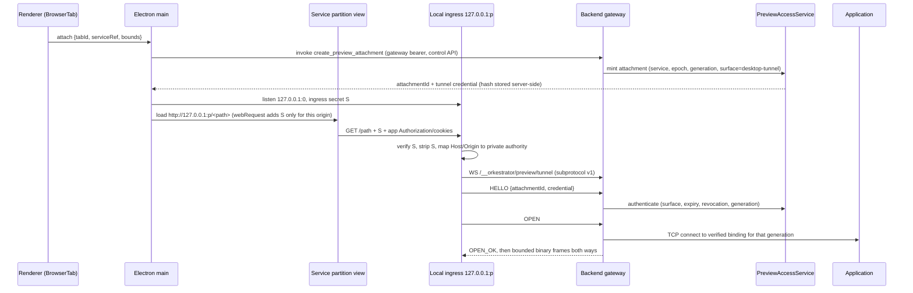

# 01 — Decision record: service preview architecture

Status: Decisions recorded 2026-09-23 against baseline `88c2f9cc`. Evidence
columns are filled from executable tests in this repository; rows that need
hardware or infrastructure this environment does not have are listed as
explicit rollout blockers, not inferred support.

This record answers the questions step 01 requires before step 02. It is the
reference the later steps implement; where implementation diverged, the
divergence is recorded here rather than hidden in code.

## Platform and fixture baseline

| Component | Version at decision time | Source |
| --- | --- | --- |
| Bun (pinned) | 1.4.2 | `mise.toml` |
| Electron | ^42.11.5 | root and desktop `package.json` |
| Node (host tooling) | 26.x | local `node --version`; not a supported runtime for the app |
| `ws` | 8.21.3 | backend dependency; added to desktop for the tunnel client |
| Operating systems | Linux (evidence host); macOS supported by the product but **not exercised here** | — |
| Docker | Linux Docker Engine on the evidence host; Docker Desktop **not exercised** | — |
| Browsers / iOS | **Not exercised** (no Safari, WKWebView, or second machine available) | — |

Application fixtures are deliberately independent of Orkestrator's own
frontend dependencies:

| Fixture | Path | Purpose |
| --- | --- | --- |
| Deterministic HTTP/WS server | `test-fixtures/preview-app/server.ts` | HTML, chunked HTML, SSE, cookies (incl. `__Host-` and forged reserved names), bearer auth, redirects, 304/206, CSP/XFO, WS echo with `fixture.v1` subprotocol, header-stall, body-stall, endless body, 1 MiB binary with SHA-256. Every response carries `x-service-marker`. |
| Vite fixture | `test-fixtures/preview-vite/` (pinned `vite` 7.3.6) | HMR socket and module graph through the tunnel; install on demand, not part of the workspace lockfile. |

The deterministic server records bounded request metadata so tests assert what
reached the upstream (Host, Origin, Authorization, Cookie, forwarding headers)
rather than only the response status. It identifies a *wrong application* by
marker, which is how decoy-port tests distinguish "loaded" from "loaded the
right service".

## Decisions

| Decision | Answer |
| --- | --- |
| Desktop remote transport | **Accepted: scoped loopback ingress + per-connection WebSocket tunnel.** Electron main binds one loopback HTTP listener per *(window connection scope, backend, service)* attachment group on an OS-assigned port. Each upstream TCP connection is carried by one outer WebSocket to the backend gateway at `/__orkestrator/preview/tunnel` using subprotocol `orkestrator.preview-tunnel.v1`. The tunnel authenticates with an attachment credential in its first control frame, then accepts exactly one `OPEN` for the grant-bound service and endpoint generation. The client never names a host, port, container, or path. Local and remote backends use the same path because both are reached through the gateway HTTP client. |
| Browser origin authority | **Operator-provisioned preview domain.** The backend serves a separate HTTPS listener for `s-<id>.<previewDomain>` service hosts and a dedicated `bootstrap.<previewDomain>` host. The operator provides wildcard DNS inside the private network and a certificate covering both, and is responsible for renewal; the backend watches the files, reloads on change, and reports expiry. Without a configured and healthy provider the backend advertises browser publication as unavailable with a reason, and desktop transport keeps working. Tailscale Serve is **not** assumed to issue per-service names. An alternate port on the control host is rejected as a substitute (cookies ignore ports). |
| Cookie boundary | The preview transport cookie is `__Host-orkestrator-preview`: `Secure`, `HttpOnly`, `Path=/`, host-only, so a sibling host cannot set or shadow it and application script cannot read it. The proxy strips it (and every other reserved name, including `orkestrator_gateway_auth`) from forwarded `Cookie` headers and drops upstream `Set-Cookie` fields that use a reserved name. Upstream `Domain` attributes are removed (host-only) rather than widened. Control cookies are never valid on preview hosts: the preview listener has no control dispatch. **Limitation:** application script on one service host can still set a parent-domain cookie for its *own* application cookie names; mutually untrusted services need separate preview domains. |
| Worker boundary | The grant is POSTed to `bootstrap.<previewDomain>`, which never serves application content, so no application service worker can be registered there. That host exchanges the grant for a one-use, 30-second, host-bound session code and redirects to `/__orkestrator_preview/session` on the service host. A hostile worker on the service origin can intercept that navigation, but the code only yields a session for the service whose code it already runs — no control authority and no other service. The reserved `/__orkestrator_preview/` prefix is never forwarded upstream. |
| Bootstrap handoff | The trusted client obtains the grant through the authenticated control API and submits it with a top-level `POST` form (`target=_blank`, `rel=noopener`). The grant never enters a URL, history entry, or `Referer`. Electron's "Open externally" serves the same auto-submitting form from a one-use loopback page whose nonce, not the grant, is in the URL. Bootstrap responses are `no-store` with `Referrer-Policy: no-referrer`. |
| Host/Origin policy | Upstream sees its **private authority**: `Host: localhost:<applicationPort>`, so framework host checks written for local development pass without permissive allowlists. The public origin is conveyed through a trusted, rebuilt `X-Forwarded-Host`/`-Proto`/`-For` set; incoming forwarding headers are always discarded. An `Origin` equal to the service's own public (or local-ingress) origin is mapped to the private origin; any other origin is forwarded unchanged so the application's own cross-origin checks still apply. Cookie-authenticated browser writes and upgrades must carry a same-service `Origin` (or `Sec-Fetch-Site: same-origin`); otherwise they are rejected before forwarding. |
| TLS | Ingress: the browser-publication listener terminates TLS with the operator certificate. Egress: HTTPS upstreams are supported on the backend HTTP/WS proxy with Node's default verification (system roots plus an optional operator CA bundle) and an explicit `tlsServerName`; verification is never disabled. The desktop raw tunnel initially supports **HTTP upstreams only**; `desktopTunnel.upstreamSchemes` advertises exactly `["http"]` and HTTPS services on desktop use the published origin when available. |
| Session persistence | Electron partitions are `persist:orkestrator-preview-svc-<slot>-<connection>-<service>`, so same-service tabs in a window share login and cookies survive restart. Local ingress origins try the previously used port first (binding, never probe-then-close) so origin-keyed storage usually survives restart; when the port is taken, a fresh port is used and localStorage continuity is lost — recorded as a limitation. Old window/connection partitions are left in place for the rollback window and are not copied into service partitions. |
| Sharing | Tabs of one service in one window share the partition and listener. Different windows or connections never share. External-browser access is a separate attachment with its own lease (30-minute idle, 8-hour absolute) that outlives the source tab and is revoked by service removal, generation change, access kill switch, or credential rotation. |
| Target scope | *Owned container*: an environment whose current container carries this backend's owner label and the environment-id label, reached only through its Docker-published loopback binding for the exact application port. *Registered worktree*: a local environment's backend-loopback port, labelled `user-registered`. *Explicit backend host*: a backend-loopback port the user associated with an environment; reserved control, bridge, agent-tool, and Docker API ports are refused. Arbitrary remote hosts are never targets. |

## Threat boundaries

Application code is untrusted relative to Orkestrator control and to other
services. Its authority is exactly the service it is previewing.

- **Local ingress is credentialed.** Port secrecy is not authentication: the
  listener requires `x-orkestrator-preview-ingress`, which Electron main injects
  through `webRequest` only for requests from that service's own partition to
  that listener's origin (HTTP and WS). The header is stripped before bytes
  enter the tunnel. Other local processes get `403`.
- **The tunnel cannot choose destinations.** Backend resolution binds the
  attachment to `(serviceId, backendEpoch, endpointGeneration)`. The upstream
  address is re-resolved and the generation re-checked immediately before
  connecting; a changed generation fails the `OPEN`.
- **Gateway credentials never ride application traffic.** The tunnel uses its
  own credential in-band. Browser sessions use a host-only preview cookie. The
  application's own `Authorization` and cookies pass through untouched.
- **Chromium sandboxing is not a firewall.** Service partitions deny requests
  from remote-backend previews to client-local loopback and private addresses
  other than the service's own ingress, so a page cannot silently fall back to
  a service on the user's machine. This is enforced through `webRequest`, not
  claimed from the sandbox.

## Complete credential and data path (desktop)

| Resource | Owner | Cleanup |
| --- | --- | --- |
| Definition, endpoint generation, readiness | Backend `PreviewServiceRegistry` | Definitions persist; runtime rebuilt on restart with a new epoch |
| Attachment + credential hash | Backend `PreviewAccessService` | Release, lease expiry, generation change, service removal, credential rotation, kill switch, shutdown |
| Tunnel sockets and upstream TCP | Backend `PreviewTunnelServer` | Closing either leg closes both; revocation closes all tracked by attachment |
| Local ingress listener, ingress secret | Electron `PreviewTransportManager` | Last attachment release + retirement lease, connection change, window close, app quit |
| Service partition cookies/storage | Electron session | Explicit "Reset site data" for that service only; never on tab switch |
| Browser preview session cookie | Browser (value) / backend (validity) | Server-side idle/absolute expiry and revocation |

## Prototype results

The prototypes were built as the production modules behind disabled-by-default
capabilities rather than throwaway code, so their evidence is the test suite
named in each row. Timings are observations, not promises.

| Prototype question | Result | Evidence |
| --- | --- | --- |
| Tunnel carries HTTP, streaming, and WS for one service only | Pass (loopback, one machine) | `apps/backend/src/preview-tunnel-server.test.ts`, `tests/unit/electron/preview-transport-manager.test.ts` |
| Tunnel cannot select another destination | Pass | tunnel tests: `OPEN` carrying host/port fields is rejected as malformed |
| Cancellation and bounded backpressure | Pass (counters return to baseline) | tunnel and HTTP proxy tests |
| Root URLs without rewriting | Pass | HTTP proxy and ingress tests serve `/`, `/assets/*`, `/api` unchanged |
| HTTPS preview host + one-use bootstrap, top-level | Pass against a generated test CA with Node clients | `apps/backend/src/preview-publication.test.ts` |
| Real browser top-level bootstrap | Pass in Chromium 153 (headless shell). Uses a throwaway CA pinned by SPKI and a resolver mapping, not real private DNS. Hostile service-worker interception not tested | `e2e/preview/private-origin.spec.ts`; see [evidence](evidence.md) |
| Hosted-client embedding with third-party cookies blocked; Safari/WKWebView | **Not run — embedded modes stay unadvertised** | Requires Safari/iOS hardware |
| Second machine (client-local fallback) | **Not run — blocker for remote desktop default-on** | Requires a second tailnet machine |
| Owned Docker containers: same internal port, host decoy, recreation with a reused port, relay | Pass on Linux Docker Engine 29.7.2 | `core/preview-docker.test.ts`, `preview-relay-supervisor.test.ts` (opt-in) |
| Docker Desktop | **Not run** | Linux Docker Engine only |

## Operational comparison

| Aspect | Desktop tunnel | Private HTTPS origin |
| --- | --- | --- |
| User setup | None | Operator DNS + certificate for `*.previewDomain` |
| Per-view cost | One loopback listener per service attachment group | None on the client |
| Per-connection cost | One outer WS per upstream TCP connection (keep-alive pooled, 8 per service) | One TLS connection per browser connection |
| Extra handshakes | WS upgrade + HELLO/OPEN per pooled connection | TLS + bootstrap once per session |
| Reconnect | New WS per connection; no replay of application bytes | Browser reconnects; session cookie until expiry |
| Works for | Electron only | Any browser that can reach the private network |

**Default order:** validated preview origin (when configured and healthy) →
desktop tunnel → legacy gateway path (explicit, with limitations shown).

*Implementation divergence (2026-09-23):* in-app desktop tabs always use the
desktop tunnel. The private origin is used for **Open in browser** and for web
and iOS clients. This keeps per-service Electron partitions as the desktop
isolation boundary. Loopback latency data is in [evidence](evidence.md).
HTTPS upstreams use the preview origin; on desktop without a preview origin they
report `unsupported` with that reason.

## Traps resolved

- Bootstrap on an origin controlled by an application worker — dedicated
  bootstrap host, service-bound one-use session code.
- Local loopback endpoints reachable by other processes — credentialed ingress.
- Cookies not isolated by port — per-service Electron partitions on desktop;
  host-per-service with `__Host-` transport cookie in browsers.
- Raw tunnel carrying gateway credentials — tunnel credential is in-band, never
  an application header; Electron ingress strips its own header.
- Absolute application URLs — not rewritten on the new route. Applications
  that hardcode another localhost origin need public-origin configuration;
  this is documented per framework rather than promised.
