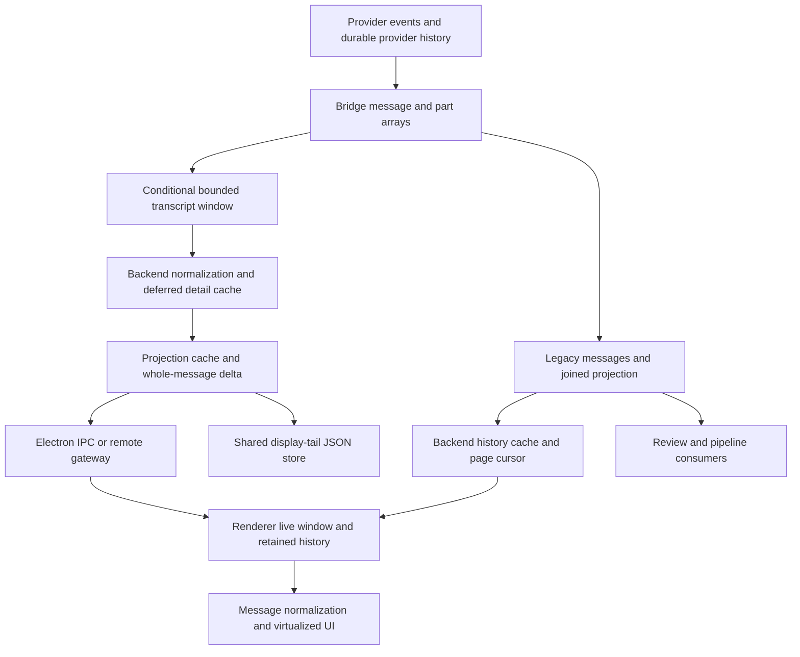

# Transcript processing, transport, and storage

See [the review index](README.md) for priority definitions and scope.

## Current data path

“Chunking” currently means bounded message windows, whole-message upserts,
history pages, and transport frames. It is not a single shared durable chunk
store or a part/text-offset delta protocol. Terminal archives are a separate
implementation and should not be conflated with agent transcripts.

## E01: Cursor does not enforce aggregate budgets during unobserved streaming

**P1 · reproduced with synthetic inputs.**

[`applyInteractionUpdate`](../../../bridges/cursor-bridge/src/translate.ts#L97)
adds messages and parts and calls `chargeTranscript`, but does not call an
aggregate bound. The production `onDelta` callback in
[`prompt.ts`](../../../bridges/cursor-bridge/src/prompt.ts#L105) invokes that
translator directly. [`chargeTranscript`](../../../bridges/cursor-bridge/src/transcript.ts#L144)
only increments a counter. Bounds run on transcript/session reads and certain
turn/recovery boundaries, rather than periodically on the producer path.

An inactive environment can therefore grow past the advertised 512 parts and
roughly 16 MiB transcript ceiling during one long turn. Individual string caps
do not cap the total number of parts. `/activity` is intentionally a cheap
no-hydration path, so background monitoring does not supply the missing bound.

The probe fed 600 separate 1 KiB reasoning blocks through the real translator
without reading the transcript. It retained 600 parts and 712,206 serialized
bytes despite a test-configured 256 KiB ceiling. Calling the read-bound function
then reduced it to 220 parts and 261,256 bytes. The part-count violation also
exceeds the production 512-part limit independently of that lowered byte cap.

**Improve:** enforce count bounds and an amortized byte budget on writes,
including nested updates and recovered streams. Pi already has
[`boundTranscriptDuringStreaming`](../../../bridges/pi-bridge/src/transcript.ts#L155)
as a local comparison. Keep lifecycle state separate from evicted display
parts, and avoid serializing the entire transcript on every token.

**Verify:** run a long synthetic turn with every transcript reader absent,
return to the tab, and confirm bounded memory plus correct truncation,
active-child state, and ongoing work.

## E02: Cursor skips all persistence when the shared state file is too large

**P1 · source-confirmed threshold failure.**

[`persistNow`](../../../bridges/cursor-bridge/src/persistence.ts#L67) serializes
every session into one payload, then returns without writing when it exceeds
`MAX_STATE_FILE_BYTES` (32 MiB). Individual session bounds do not constrain the
aggregate: several large, still-open sessions can each be valid but exceed the
file ceiling together. There is no aggregate shedding in this writer.

Once the total remains above the ceiling, later scheduled writes keep paying
the serialization cost and keep being skipped. This affects session metadata
and dispatch journals as well as display history. `persistBarrier` waits for a
tail that catches errors, and an over-budget `persistNow` is treated as a
successful return, so it does not prove that the prepared journal was written.
Actual duplicate dispatch after a crash was not exercised in this review.

**Improve:** separate essential durable metadata/journals from expendable
transcript caches. Make dispatch barriers report an unsuccessful durable write.
As a narrower first fix, use an explicit aggregate display budget and shed
recoverable transcripts before serialization; retain accurate incompleteness
metadata. Pi's
[`shedToFit` and explicit barrier](../../../bridges/pi-bridge/src/persistence.ts#L54)
already address this distinction, though that implementation can also be made
more efficient by avoiding repeated whole-payload sizing.

**Verify:** cross 32 MiB using multiple individually valid sessions, then mutate
metadata and prepare a dispatch. Restart an isolated bridge and verify the
durable records, or verify dispatch was refused when persistence failed.

## E03: Claude's unchanged response still hashes the whole transcript

**P1 · reproduced shared-helper behavior; source confirms Claude uses it.**

Claude's [`GET /:id/transcript`](../../../bridges/claude-bridge/src/routes/session.ts#L535)
passes no `revision` to `bridgeTranscriptUpdate`. In
[`bridgeTranscriptToken`](../../../packages/protocol/src/progressive-transcript.ts#L42),
that selects `digest(JSON.stringify(messages))`. Token computation occurs
before the unchanged check and before taking the last `limit` messages.

Consequently, asking for a 100-message/512 KiB tail of an unchanged hydrated
Claude conversation still serializes and walks its entire history. Limiting
response bytes or adding gzip cannot eliminate this cost. The helper probe
visited all 1,000 synthetic messages on an unchanged read; providing a revision
visited zero. Codex, Cursor, and Pi already supply revisions at their routes.

**Improve:** track a bridge-owned transcript revision and content epoch at all
mutation sites: text and tool updates, hydration/overlay installation, rewinds,
and deletions. Generate the token from those plus the window identity. Preserve
correct invalidation for display metadata such as titles; do not use an
incomplete mutation counter just to make the unchanged path cheaper.

**Verify:** an unchanged poll must not traverse message contents regardless of
history length. Mutating any visible transcript field, replacing history, and
hydrating an initially empty preview must invalidate the correct token.

## E04: Display-tail storage amplifies one session update across all sessions

**P1 · source-confirmed read/write amplification.**

[`getNativeAgentDisplayTail` and `putNativeAgentDisplayTail`](../../../apps/backend/src/core/storage-native.ts#L707)
both load the shared `native-agent-display-tails.json` file under the same
mutation queue/lock. `loadNativeAgentDisplayTails` checks every entry's checksum.
A write then serializes all tails for eviction accounting and calls
`saveSensitiveJson`, which pretty-prints the whole store and normally rotates
five backups. The backup path can read and parse the primary again before
copying it; see [`storage-base.ts`](../../../apps/backend/src/core/storage-base.ts#L1137).

The cache permits 128 tails and 64 MiB of aggregate compact JSON. A change to
one small tail therefore causes work proportional to all retained tails, with
additional backup I/O. A cold read of one tail also pays for every entry and
waits behind writes. Pretty-printing means the compact byte budget is not an
exact disk-file ceiling.

The existing two-second debounce reduces writes but is per session. It neither
batches different sessions nor bounds the time until a checkpoint during
continuous updates: each changed tail restarts the timer. Shutdown clears
pending tails in `settleAndClearProgressiveReads`, so continuous streaming can
also leave the restart preview stale. Provider history remains authoritative.

**Improve:** store bounded tails independently, or use a transactional keyed
store, with a small eviction index. Validate/checksum only changed or loaded
records. Coalesce writes across sessions and add a maximum checkpoint age.
Retain atomic replacement, private permissions, deletion/backup scrubbing,
and separation from authoritative dispatch data.

**Verify:** update one tail with 1, 32, and 128 cached sessions and measure bytes
read/written, checksum time, lock wait, and first-tail latency after restart.
The update cost should be proportional to the changed record, not the store.

## E05: Streaming deltas replace whole messages and repeat content processing

**P2 · source-confirmed amplification; magnitude needs profiling.**

The [`bridge transcript envelope`](../../../packages/protocol/src/progressive-transcript.ts#L76)
returns either unchanged or a bounded snapshot. On a change, even unaffected
messages in that window cross the bridge/backend boundary again. Downstream,
[`transcriptDelta`](../../../apps/backend/src/core/native-agent-service-projection.ts#L1455)
compares messages using `JSON.stringify` and sends complete changed messages as
`messageUpserts`; there are no part-level or append-offset operations.

Backend processing also projects every candidate message, sizes it for bounds,
hashes projected messages for the token, sizes the view for cache accounting,
and sizes delta and snapshot candidates. Heavy tool details are serialized and
hashed in `cacheToolDetails` before an existing cache entry is recognized.
The fast unchanged-source branch already skips much of this; the concern is
the active changed path.

For an append-only message with equal increments, transmitting every full
prefix transfers `increment × k(k+1)/2` bytes over `k` observations before caps
or segmentation intervene. This is a scaling illustration, not measured
network traffic. Codex's 100/250/500 ms coalescing and message segmentation
already reduce the number and size of observations.

**Improve:** first memoize immutable completed messages/parts, their encoded
sizes, and detail references by trustworthy revision. Reuse measurements
within one read. Then evaluate stable part-ID updates and text appends carrying
an expected base revision/offset. A mismatch must fall back to an authoritative
snapshot; rewinds and non-append tool changes need explicit replacement/delete
operations. Retain byte/count limits and immediate terminal/approval updates.

**Verify:** compare bridge bytes, backend CPU, and UI latency for a growing
message and many completed tool parts. Include reconnect, missed updates,
history rewrite, slow clients, and two clients holding different base tokens.

## E06: Heavy details are deferred after the bridge has already transferred or trimmed them

**P2 · source-confirmed layering issue.**

`bridgeTranscriptUpdate` applies the 512 KiB target to raw messages containing
tool bodies and attachments. Only later does backend
[`projectionPart`](../../../apps/backend/src/core/native-agent-service-projection.ts#L785)
replace output/diff/image payloads with detail references. Thus a raw tool
result or screenshot can displace earlier messages or parts even when the
eventual lightweight UI representation would fit.

The backend explicitly compensates through
[`scheduleIncompleteProgressiveHydration`](../../../apps/backend/src/core/native-agent-service-projection.ts#L1572).
For an incomplete preview that does not fill the projected window, it calls
`provider.messages({limit})`. For HTTP providers,
[`messages`](../../../apps/backend/src/core/http-bridge-provider.ts#L599)
reads the legacy response first and slices locally. The requested limit does
not reduce that upstream read. Changing source tokens can cause this recovery
to be considered again during streaming. Recovery is conditional, not a second
read on every poll.

**Improve:** have bridges expose lightweight message/part summaries and
session-scoped, revisioned detail handles before applying window limits.
Retrieve large payloads separately and lazily. A bounded legacy tail endpoint
is a useful intermediate step. Avoid introducing another independent
authoritative transcript database solely to serve these references.

**Verify:** use large tool results and inline images alongside a small prompt.
The prompt should remain in the summary window; repeated text updates should
not resend unchanged artifacts or trigger full-history hydration. Expired
detail handles must have an explicit recovery path.

## E07: History pages rebuild the joined projection before serving the page

**P2 · source-confirmed work proportional to more than the requested page.**

[`getMessagePage`](../../../apps/backend/src/core/native-agent-service-projection.ts#L2688)
first forces `refreshProjection` in `sync-v1` mode. That path obtains an
interactive snapshot, normalizes up to 4,096 messages within a 16 MiB projected
bound, obtains supplementary session state, and calls
[`updateProjectionHistory`](../../../apps/backend/src/core/native-agent-service-projection.ts#L1085).
The latter fingerprints each message and serializes the whole retained history
for byte accounting before the requested page is selected.

Normal progressive tail polling avoids this path, which is a valuable existing
optimization. It remains a cost for each history page and joined fallback.
Claude cold hydration also requests and normalizes persisted session messages
without a tail/page argument in
[`readPersistedSessionMessages`](../../../bridges/claude-bridge/src/services/session-manager-persistence.ts#L364).
The UI's page size therefore does not bound all upstream parsing work.

**Improve:** serve a validated existing history epoch/page directly from cache.
When absent, retrieve only the required provider range or indexed record
chunks. Separate history reads from composer/discovery refresh. Use immutable
historical chunks plus a mutable tail; invalidate the relevant epoch on rewind,
fork/replacement, or loss of provider identity. Provider capabilities need to be
verified before selecting an indexed-file or provider-native implementation.

**Verify:** measure source bytes and normalization work for repeated pages of
a long session. Also edit or rewind already paged history and verify stale
cursors are rejected rather than returning cached obsolete content.

## E08: Codex rollout caching does not bound the cost of a cold read

**P2 · source-confirmed allocation and eviction risks.**

[`transcript-cache.ts`](../../../bridges/codex-bridge/src/transcript-cache.ts#L14)
already avoids metadata-driven full reads and supports incremental append
parsing. Remaining costs are:

- A cold read uses `readFile` for the whole rollout, splits it into lines, and
  parses records before cache admission. There is no bounded streaming parser
  or maximum individual cold-read allocation in that function.
- Accounting uses source file size, although parsed objects occupy additional
  heap. The 64 MiB soft/256 MiB hard budgets are not resident-heap ceilings.
- An entry larger than the hard budget can evict itself immediately. Its next
  read starts from scratch again. The active grace period helps working sets
  below the hard budget but cannot solve this oversized-entry case.
- Appending records copies the whole records array, and concurrent reads of
  the same path have no in-flight promise sharing at this cache boundary.

These reads are used by rollout recovery and subagent rendering, not just an
offline history browser. Actual peak RSS or repeated oversized-file reads
were not measured here.

**Improve:** share concurrent reads per file identity, add bounded incremental
JSONL parsing with explicit large-record handling, and retain chunked/indexed
records instead of requiring the whole rollout to be resident. Account for
parsed retention conservatively. Preserve the existing inode/truncation checks,
partial trailing-record behavior, and cheap metadata-head path.

**Verify:** cover a single file above the hard budget, a multi-agent working
set above it, concurrent cold requests, appends, rotation, and a malformed or
oversized JSONL record. Measure actual peak heap as well as source-byte counts.

## E09: Provider trimming still repeatedly serializes the shrinking transcript

**P2 · reproduced for Cursor; the same algorithm is present in Pi and ACP.**

[`Cursor boundTranscript`](../../../bridges/cursor-bridge/src/transcript.ts#L79),
[`Pi boundTranscript`](../../../bridges/pi-bridge/src/transcript.ts#L82), and
[`ACP boundTranscript`](../../../bridges/acp-bridge/src/acp-transcript.ts#L698)
recompute whole-transcript serialized size as they remove oldest messages or
parts. When many entries must be shed, retained data is visited repeatedly;
the worst case is quadratic in the number of similarly sized entries removed.
Read-side dirty counters avoid this for unchanged transcripts, but do not
remove the spike when a dirty transcript is over budget.

The synthetic 100-message Cursor probe retained 31 messages and invoked message
serialization 4,585 times. The shared `boundTranscriptResponse` retained the
same 31 and serialized 100 messages. This is a count comparison, not an
end-to-end speedup measurement.

**Improve:** maintain or compute per-message/per-part sizes once, subtract
removed sizes, then slice once. Preserve each bridge's truncation markers and
task-lifecycle handling. The shared helper already uses subtractive size
accounting; its own repeated `parts.shift()`/`partSizes.shift()` can be replaced
with an index and final slice as a smaller follow-up.

**Verify:** count serialization visits and event-loop delay for many small parts
and a single large part. Include multibyte text and exact envelope/comma bytes;
the optimization must not weaken transport bounds or remove active lifecycle
records.
