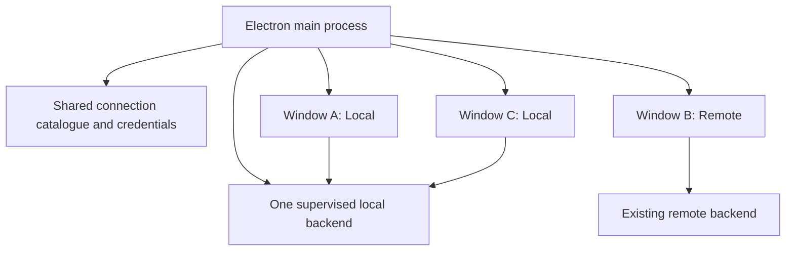

# Multiple desktop windows with shared backends

Status: initial multi-window implementation completed and validated, 2026-09-08.

## Recommendation

Keep one Electron main process per application data directory and one local
`BackendProcess` owned by that process. Give each application window its own
connection binding, renderer state, native previews, and lifecycle. Windows
using Local share the existing backend; remote windows connect to the selected
server without starting another backend on the desktop.

The backend process boundary is already suitable. Most work is removing
application-wide assumptions from desktop connection routing and presentation.
A separate always-running daemon is unnecessary for this feature.

Arrows from windows to backends represent logical connections. Commands and
general events currently pass through Electron IPC and `BackendHttpClient`;
some agent, file, and preview traffic uses renderer-side gateway URLs. Both
paths must use the same window binding.

## Implemented result

- File > New Window (`CmdOrCtrl+N`) creates another application window without
  starting another local backend. A saved Local or remote connection can also
  be opened directly from Connections settings.
- Each window has a sender-owned connection scope. IPC commands, dialogs,
  gateway controls, request authentication, backend events, menu actions, and
  native browser previews resolve through that scope.
- Remote connections are pooled by connection ID. Windows sharing a server use
  one desktop event client; the last window release stops that client without
  stopping work on the server.
- Renderer and browser-preview sessions use bounded, connection-keyed per-window
  partitions. The first renderer retains the legacy default session long enough
  to migrate existing presentation preferences; preview cookies are never reused
  by a window opened on another connection.
- Every visible active terminal pane in the focused Electron window publishes
  geometry, including visibility-redraw and Claude interactive-tmux paths.
  Background windows publish none and reclaim geometry when focused.
- A failed local backend marks Local unavailable while remote windows stay
  open. Local windows show a persistent restart action, the in-memory connection
  catalogue remains usable for that Electron process, and forgetting a
  connection is refused while another window uses it.
- Connection names are enforced in native window titles. New windows inherit
  the focused window's connection, while `--new-window` is forwarded through
  the existing single-instance process.

New-window requests received during startup remain queued until initialization
and privileged IPC registration finish. Released window scopes are invalidated,
so late connection work cannot recreate a closed scope or fall through to Local.

The current release still starts the one owned local backend during desktop
startup, even if the first view selects a remote. Durable catalogue ownership
also remains in that backend; after it fails, catalogue changes are session-only
until restart. Remote-only cold startup, in-process Local recovery, document
generation envelopes, and restoring an arbitrary set of windows remain later
lifecycle work. Shared tab membership remains intentional; only presentation
selection is window-local.

## What the code does today

| Area | Evidence | Consequence for multiple windows |
| --- | --- | --- |
| Process ownership | [`main.ts`](../../apps/desktop/electron/main.ts) creates one `BackendProcess`; `startApplication()` starts it before creating the window. | Creating another window need not start another backend. |
| Second launch | [`single-instance.ts`](../../apps/desktop/electron/single-instance.ts) locks by `userData` and focuses the existing window. | Preserve this protection against duplicate storage writers; forward new-window requests to the primary process. Development profiles remain separate. |
| Connection selection | [`connection-manager.ts`](../../apps/desktop/electron/connection-manager.ts) has one `activeRemote`, one stored `activeConnectionId`, and stops the previous remote listener on switch. | A second window cannot choose a different server safely. |
| IPC | [`ipc.ts`](../../apps/desktop/electron/ipc.ts) validates the sender URL but calls global `getBackend()` and `getMainWindow()` functions. | Commands, gateway settings, dialogs, zoom, and preview operations need sender-specific routing. |
| Events and menus | `main.ts` sends backend events and Close Tab/Zoom actions to every `BrowserWindow`. | Backend events need connection routing; menu actions need focused-window routing. |
| Bootstrap | [`preload-api.ts`](../../apps/desktop/electron/preload-api.ts) synchronously reads the connection list and exposes the remote gateway origin. The sidebar switches and reloads. | Bind a window before loading its renderer; reload only that window when switching. |
| Authentication | [`remote-gateway-request-auth.ts`](../../apps/desktop/electron/remote-gateway-request-auth.ts) gets credentials from the single active remote, on `defaultSession`. | Authentication must be tied to the requesting window and document, not the last selected server. |
| Native previews | [`browser-preview-startup.ts`](../../apps/desktop/electron/browser-preview-startup.ts) uses one persistent partition and manager; window close calls `destroyAll()`. The manager keys views by tab ID. | Two windows can collide on a tab ID, use the wrong parent or credentials, and destroy one another's previews. |
| Local renderer persistence | [`uiStore.ts`](../../apps/web/src/stores/uiStore.ts) persists `ui-storage`, including recent project IDs and zoom, in shared local storage. | Separate renderer heaps do not by themselves isolate persisted state or Chromium zoom. |
| Pane selection | [`pane-layout-authoritative.ts`](../../apps/web/src/lib/pane-layout-authoritative.ts) deliberately adopts backend active-pane and active-tab selection. | Two windows viewing the same environment currently share focus. This is a product behavior change to address explicitly. |
| Failure and quit | `main.ts` quits the whole application on unexpected local backend exit. [`backend-lifecycle.ts`](../../apps/desktop/electron/backend-lifecycle.ts) stops the local process on `before-quit`. | A local backend failure currently closes remote windows too. Window close and app quit need distinct treatment. |

Electron supports identifying the requesting window from IPC `event.sender`;
retain sender validation as well as looking up ownership. See the
[official IPC guide](https://www.electronjs.org/docs/latest/tutorial/ipc).
Session partitions provide separate browser storage contexts; the same partition
reuses a session. See the
[session API](https://www.electronjs.org/docs/latest/api/session).
Install request hooks once per session: Electron uses only the last listener
attached for a given WebRequest event. See the
[WebRequest API](https://www.electronjs.org/docs/latest/api/web-request).
These APIs were checked through Context7 and the official documentation.

## Proposed ownership model

### Application-wide services

- `LocalBackendHost`: wraps the existing supervisor and shared local client.
  Startup is single-flight. Opening, reloading, or closing a window never calls
  process start/stop. Only explicit application shutdown stops the owned child.
- `ConnectionCatalog`: saved addresses, encrypted credentials, session-only
  credentials, and serialized catalogue mutations. It has no active connection.
- `ConnectionPool`: at most one desktop general-event listener/client per used
  connection, with window subscribers. Sharing a connection does not share
  renderer view state. In-flight acquisitions are single-flight; last release
  stops consumption, never the remote backend or its agent work.
- `WindowRegistry`: maps trusted renderer `webContents.id` to a window context;
  separately tracks application windows and the most recently focused one.
  Bootstrap windows and DevTools are not application windows.

Keep these boundaries testable modules; the names are proposed, not existing
classes. Bound catalogue size, pending window-open requests, and any fan-out
queues. Slow or crashed renderers must not stall backend event consumption.

### Window context

Each context contains a stable window ID, BrowserWindow, connection ID,
document generation, renderer session, preview manager, and subscription
release handles. The preload receives only non-secret bootstrap metadata:
window ID, generation, connection summary, and gateway origin.

Register this context and install its session hooks before `loadURL`/`loadFile`.
Today `createMainWindow()` loads the renderer before returning; split allocation
from loading or supply a pre-load registration callback. Otherwise the preload's
synchronous connection lookup can run before ownership is registered.

IPC handlers resolve the context from the real sender and trusted main frame.
Do not accept an arbitrary renderer-supplied window ID as authority. Capture
the selected client at request admission, before asynchronous work, so an
already-started command cannot move to another server during a switch.

General events are dispatched only to ready windows bound to the originating
connection. Catalogue-change notifications can reach all application windows,
but each receives its own active flags. Preview events go only to their owner;
menu actions go only to the focused application window, including when one of
its native previews has keyboard focus.

### Switching connections

Keep the existing full renderer reload approach initially:

1. Validate credentials and acquire the target connection while the old binding
   remains usable. A failed probe leaves the current window unchanged.
2. Quiesce that renderer's pending presentation writes, preserving drafts through
   existing persistence. Capture/settle old work against the old client.
3. Mark its old document generation inactive. Reject new ordinary IPC from that
   generation and stop delivering its events; clean up only its native previews.
4. Commit the new binding and initiate reload from main. Preload bootstraps a new
   generation before normal commands and subscriptions become available.
5. Rehydrate authoritative snapshots and pending interactions. A window joining
   an already-open pooled stream still needs an explicit reconcile signal.

Include a document generation in preload IPC/event envelopes so stale calls or
queued events cannot be mistaken for the new connection. Direct gateway clients
retain immutable document-scoped origins and are disposed on reload. Never
replay a command with an ambiguous outcome merely because the window switched.
Serialize switches per window and discard late probe results after close or a
superseding switch. A failed renderer load shows a recoverable window error.

### Browser sessions and previews

Use a distinct renderer session partition per stable window ID. This isolates
same-origin browser storage and zoom between windows. Namespace backend-specific
storage keys by connection ID within that window, so Local data is not restored
as remote data after switching. Audit all persisted stores, not just `ui-storage`.

Use one preview manager per window, with a preview partition scoped to window
and connection, separate from the privileged renderer. Register request and
permission hooks once per session; callbacks resolve only the owning context.
Retain the current preview-origin/path restrictions and clipboard activation
checks. Unknown owners and obsolete generations never receive credentials.

Never mutate session-wide auth in response to focus. Credential rotation updates
the shared connection entry and all of its consumers, with reconciliation only
in affected windows. Close/reload destroys only that window's views. A pair of
windows may display the same backend tab using two distinct native views.

Start with bounded persistent window records and partitions, reclaiming retired
window state through an explicit retention policy. Migrate legacy renderer
preferences once into the first window; do not copy legacy project-specific
values indiscriminately into remote connections. Preview cookies are independent
between windows under this proposal; cross-window preview login sharing can be
designed separately if desired.

## Shared backend state versus independent presentation

Projects, environments, sessions, transcripts, running terminals, jobs, and
approval state remain backend-owned and shared. Opening another window must not
create a new agent session merely to display an existing one.

Selected environment, active pane/tab, zoom, scroll position, and history depth
should be independent per window. The pane-selection change requires special
care: the current implementation intentionally synchronizes focus across
clients. Introduce a client-view selection overlay, keyed by window/connection
and environment, over the authoritative structural layout. Preserve valid local
selection on structural updates; choose a valid fallback when another client
removes the selected tab. Keep the backend selection as an initial/default value
for existing browser/mobile clients, rather than silently changing their
restore behavior. Persist only presentation in the overlay, never running work.

For the first release, keep tab membership and split layout shared per backend
environment. Consequently, explicitly closing a shared session tab is visible
in both windows. Closing a native window only releases its view. Fully independent
tab sets need a further separation of session lifetime from layout membership
and should not be slipped into this change.

Audit same-session composer drafts, approval responses, terminal input, and
terminal geometry before declaring same-backend support complete. Drafts already
have conflict-related modules; establish their behavior with two live clients
before proposing new storage. Two answers to one approval must resolve once,
with the other window reconciling the already-resolved interaction.

`terminal_resize` applies dimensions directly to the shared terminal. The
implemented renderer owner rule allows every visible pane in the focused window
to publish while suppressing background windows, and it covers regular PTY
resizes, visibility redraws, and Claude interactive tmux. A focused window
re-publishes its current geometry on focus. If runtime testing still exposes
races between renderers, use a backend-owned viewer lease rather than weakening
this rule. `detach_terminal` explicitly closes a session, so it must never become
a generic window-close cleanup operation. `useTerminal` already releases only
renderer listeners on ordinary unmount.

## Lifecycle and connection management behavior

- Add File > New Window (`CmdOrCtrl+N`), initially inheriting the focused
  window's connection, and “Open in new window” for each saved connection.
  Always show the connection name in the window title and existing switcher.
- Preserve ordinary second-launch focus behavior; an explicit `--new-window`
  request is forwarded to the primary instance. Queue it safely during startup.
  The single-instance lock remains scoped to the existing runtime profile.
- Closing one window leaves all other windows and the local backend running.
  Keep current last-window policy initially: Linux/Windows quit, macOS can stay
  resident. Explicit Quit closes all windows and stops the local child once.
  Keeping local jobs alive after application quit is a separate daemon feature.
- A remote disconnection leaves that window on its chosen server with reconnect
  controls. Do not silently switch it to Local. Other connections continue.
- A local backend exit marks Local unavailable and leaves remote windows usable.
  Local windows retain a persistent unavailable state with an explicit full-app
  restart action. Any future in-process recovery must confirm the old owned child
  is gone and reconcile uncertain operations before dispatching new work.
- Reject forgetting a connection while another window uses it, explaining which
  windows must close/switch first. Removing a saved token and rotating the remote
  gateway token are distinct actions. Rotation necessarily affects every client
  of that server; update this app's pooled clients and request hooks together.

The catalogue is currently stored through local backend commands. To let remote
windows keep managing connections after a local backend failure, move ownership
to an atomic, versioned main-process store in this profile's `userData` directory.
Reuse existing encrypted records and session-only fallback; do not duplicate
plaintext tokens. Import legacy records once, only after a successful read, and
preserve the legacy file for rollback. A failed import must not be recorded as
an empty successful migration. The old global active ID seeds the first window
or a default, never all live bindings. Keep deprecated backend commands readable
during migration; avoid two active writers to the new catalogue.

Full multi-window restore and remote-only cold startup without local toolchain
provisioning are follow-ups. Initially restore the last focused window's
connection using an explicit unavailable state if it cannot reconnect. Existing
startup can still launch one local backend even when the first window is remote.

## Implementation sequence

1. **Connection ownership and persistence.** Extract catalogue and pooled clients
   from `connection-manager.ts`; add window bindings while retaining a one-window
   adapter. Migrate catalogue persistence and test concurrent token changes,
   failed switches, and single-flight client acquisition.
2. **Window contexts and routing.** Refactor `main.ts`, `window.ts`, `ipc.ts`,
   `preload-api.ts`, `backend-lifecycle.ts`, menu and second-instance helpers.
   Register contexts before navigation; add generation checks and scoped event
   delivery. Keep New Window unexposed until auth and preview isolation land.
3. **Storage, authentication, and native previews.** Add renderer/preview
   partitions, scoped persistence, owner-specific managers and session hooks.
   Audit direct gateway transports, dialogs, clipboard, and gateway settings.
   Test Local + Remote and Remote A + Remote B with overlapping entity IDs.
4. **Independent presentation and lifecycle.** Implement pane-selection overlay;
   verify shared draft/approval/terminal behavior and resolve geometry ownership.
   Isolate local backend failure, then expose New Window and connection actions.
5. **Real-stack validation and rollout.** Extend Electron integration coverage
   for two windows, backend PID identity, routing, reload, close, and failure.
   Validate packaged rendering as well as development URLs. Document shared-tab
   behavior and the existing last-window quit policy.

Steps 1–3 are prerequisites for any usable multi-window build. Step 4 is required
before claiming that two windows can independently work in the same environment.
This is a cross-cutting desktop change with targeted renderer/backend work,
not just a menu addition. No backend wire-protocol replacement is required for
the primary Local + Remote use case; a terminal viewer lease, if needed, should
be additive with an explicit fallback for older remote servers.

## Acceptance and validation

| Scenario | Required result |
| --- | --- |
| Open two Local windows and reload both | Same local backend PID throughout; opening a view alone creates no duplicate agents or terminals. |
| Local + Remote; Remote A + Remote B | Commands, events, requests, credentials, settings, and titles stay with the correct connection, including colliding entity IDs. |
| Switch one window during a delayed request | Admitted work stays on the old backend; stale completion/events do not affect the new view; the other window is unchanged. |
| Two windows use one remote | One pooled desktop general-event listener; either can close without disconnecting the other. Existing per-view agent/terminal streams are counted separately. |
| Same environment in two windows | Independent active panes/tabs; structural edits and session completion reconcile in both; draft conflicts are visible. |
| Same preview tab in two windows | Independent native views, bounds, focus and zoom; closing one does not destroy the other. |
| Two differently sized terminal views | No repeated competing resizes; closing/minimizing one preserves the terminal and output in the other. |
| Pending approval during close/switch | Remaining/reopened window rehydrates the pending card; concurrent responses resolve once; technical failures never approve. |
| Work progresses while originating window is inactive/closed | Returning or opening a new window recovers status, transcript, pending prompts, and controls from snapshots. |
| Disconnect/reconnect one server | Only its windows enter recovery; missed events trigger reconciliation; no ambiguous command auto-retry. |
| Local backend dies with remote window open | Remote window remains usable, including connection catalogue operations; Local shows a recovery state. |
| Second launch, last-window close, explicit Quit | One backend per profile, correct platform quit behavior, no duplicate startup or preview cleanup. |
| Rotate token; forget a connection in use | Affected windows update coherently; other servers are untouched; forgetting cannot silently redirect a window. |
| Old remote backend | Existing routes still work; any new capability has a tested fallback or a clear unsupported state. |

Extend owning tests under `tests/unit/electron/`, renderer pane/persistence tests,
and backend tests only where behavior changes. Follow the repository's logged
test workflow; run focused explicit-path Bun suites with `--parallel`, relevant
desktop/web/backend typechecks, format and lint checks, then `mise run test` for
the completed cross-cutting change.

Use isolated `dev:test` profiles and the seeded fixture, following
[`agent-testing.md`](../development/agent-testing.md). Run browser smoke and
`test:agent:electron`; add genuine two-window checks to the latter. Use two
isolated backend profiles to simulate separate machines without touching live
user data, then verify remote HTTPS/authentication against a controlled gateway.
Observe PID/counts and non-content metadata only. Clean up all test profiles.

Validation now covers scoped connection routing and pooling, per-window IPC and
preview ownership, storage and pane-selection isolation, focused terminal
geometry, menu and second-instance creation, and the real Electron main/preload
stack. The Electron smoke opens two Local windows, proves the backend PID is
unchanged, closes one, and invokes the same backend successfully from the
remaining window. Controlled Local + Remote and packaged-build manual exercises
remain useful release checks because they require a second authenticated
backend and packaged application artifact.
